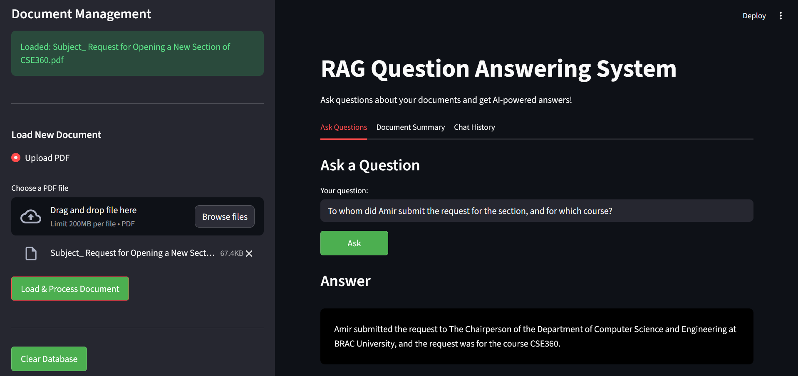
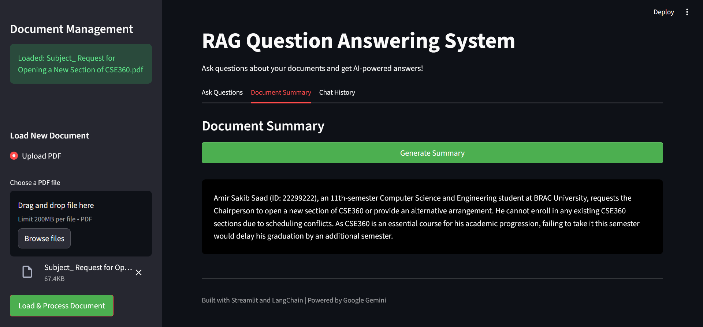

# RAG Question Answering System

An intelligent Document Question Answering system powered by Retrieval-Augmented Generation (RAG) technology. This application enables users to upload PDF documents and interact with them through natural language queries, receiving accurate, context-aware responses backed by source citations.



## Table of Contents

- [Overview](#overview)
- [Key Features](#key-features)
- [Architecture](#architecture)
- [Technology Stack](#technology-stack)
- [Installation](#installation)
- [Usage](#usage)
- [How It Works](#how-it-works)
- [Screenshots](#screenshots)
- [Configuration](#configuration)
- [Project Structure](#project-structure)
- [Contributing](#contributing)
- [License](#license)

## Overview

This RAG-based Question Answering system bridges the gap between static documents and dynamic information retrieval. By combining vector embeddings, semantic search, and large language models, the application transforms any PDF document into an interactive knowledge base that can answer questions, provide summaries, and cite sources with precision.

## Key Features

### Document Processing
- **PDF Upload Support**: Seamlessly upload and process PDF documents of any size
- **Intelligent Chunking**: Automatically splits documents into optimized chunks for better retrieval
- **Persistent Storage**: Vector embeddings stored in ChromaDB for fast retrieval across sessions

### Advanced Question Answering
- **Context-Aware Responses**: Answers grounded in document content with source attribution
- **Multi-Source Retrieval**: Fetches top 5 most relevant chunks for comprehensive answers
- **Source Citation**: Every answer includes expandable source excerpts for verification

### Document Summarization
- **AI-Powered Summaries**: Generate concise overviews of entire documents
- **Key Point Extraction**: Highlights main ideas and critical information
- **Quick Understanding**: Get document insights without reading the full text



### Chat Management
- **Persistent Chat History**: All Q&A pairs saved within session
- **Historical Review**: Browse previous questions and answers
- **Source Tracking**: Each historical query maintains its source references

### User Experience
- **Modern UI**: Clean, intuitive interface built with Streamlit
- **Real-time Processing**: Visual feedback during document loading and query processing
- **Responsive Design**: Works seamlessly across different screen sizes
- **Database Management**: Easy clear and reset functionality

## Architecture

The system implements a sophisticated RAG pipeline:

```
PDF Document → Text Extraction → Chunking → Embedding Generation → Vector Storage
                                                                          ↓
User Query → Query Embedding → Similarity Search → Context Retrieval → LLM → Answer
```

### RAG Pipeline Components

1. **Document Ingestion**
   - PyPDFLoader extracts text from uploaded PDFs
   - Handles multi-page documents with proper text flow preservation

2. **Text Chunking**
   - RecursiveCharacterTextSplitter creates optimal chunks (1000 chars, 200 overlap)
   - Maintains semantic coherence across chunk boundaries
   - Uses hierarchical splitting: paragraphs → sentences → words

3. **Embedding Generation**
   - Google's `gemini-embedding-001` model converts text to 768-dimensional vectors
   - Captures semantic meaning beyond keyword matching
   - Enables conceptual similarity search

4. **Vector Storage & Retrieval**
   - ChromaDB stores embeddings with persistent disk storage
   - Cosine similarity search finds most relevant chunks
   - Configurable k-value (default: 5) balances precision and context

5. **Answer Generation**
   - Gemini 2.5 Flash processes retrieved context
   - Strictly grounds answers in provided documents
   - Explicitly states when information isn't available

## Technology Stack

| Component | Technology | Purpose |
|-----------|-----------|---------|
| **Frontend** | Streamlit | Interactive web interface |
| **LLM** | Google Gemini 2.5 Flash | Answer generation |
| **Embeddings** | Gemini Embedding 001 | Semantic text vectorization |
| **Vector DB** | ChromaDB | Persistent vector storage |
| **Framework** | LangChain | RAG orchestration |
| **Document Loading** | PyPDFLoader | PDF text extraction |
| **Language** | Python 3.8+ | Core implementation |

## Installation

### Prerequisites

- Python 3.8 or higher
- Google API Key (for Gemini access)

### Step-by-Step Setup

1. **Clone the repository**
```bash
git clone https://github.com/yourusername/rag-qa-system.git
cd rag-qa-system
```

2. **Create virtual environment**
```bash
python -m venv venv
source venv/bin/activate  # On Windows: venv\Scripts\activate
```

3. **Install dependencies**
```bash
pip install -r requirements.txt
```

4. **Configure environment variables**

Create a `.env` file in the project root:
```env
GOOGLE_API_KEY=your_google_api_key_here
```

To obtain a Google API key:
- Visit [Google AI Studio](https://makersuite.google.com/app/apikey)
- Create a new API key
- Copy and paste into your `.env` file

5. **Run the application**
```bash
streamlit run app.py
```

The application will open in your default browser at `http://localhost:8501`

## Usage

### Loading a Document

1. Click on **"Upload PDF"** in the sidebar
2. Select your PDF file
3. Click **"Load & Process Document"**
4. Wait for confirmation: "Successfully indexed X chunks!"

### Asking Questions

1. Navigate to the **"Ask Questions"** tab
2. Type your question in the input field
3. Click **"Ask"**
4. Review the answer and expand source citations

### Generating Summaries

1. Switch to the **"Document Summary"** tab
2. Click **"Generate Summary"**
3. Read the AI-generated overview

### Managing History

1. Open the **"Chat History"** tab
2. Browse previous questions and answers
3. Expand any entry to see full details and sources

### Clearing Database

- Click **"Clear Database"** in the sidebar to reset
- Removes all stored embeddings and history
- Allows loading a new document fresh

## How It Works

### 1. Document Processing Pipeline

When you upload a PDF:
```python
PDF → PyPDFLoader → Raw Text → RecursiveCharacterTextSplitter → Chunks
```

Each chunk is optimized for:
- **Semantic Completeness**: Contains meaningful information units
- **Context Preservation**: 200-character overlap maintains continuity
- **Retrieval Efficiency**: 1000-character size balances detail and speed

### 2. Embedding & Indexing

```python
Chunks → Gemini Embedding Model → 768D Vectors → ChromaDB Storage
```

The embedding model:
- Captures semantic meaning, not just keywords
- Enables finding conceptually similar content
- Creates searchable vector representations

### 3. Query Processing

When you ask a question:
```python
Query → Embed → Similarity Search → Top 5 Chunks → LLM Context
```

The retrieval process:
- Converts your question to a vector
- Compares against all stored vectors
- Returns most semantically similar chunks
- Ensures relevant context for the LLM

### 4. Answer Generation

```python
Context + Query → Gemini 2.5 Flash → Grounded Answer + Sources
```

The LLM:
- Only uses provided context (no hallucination)
- Synthesizes information across multiple chunks
- Explicitly states if information isn't available
- Returns source documents for verification

## Screenshots

### Question Answering Interface

*Ask questions and receive accurate answers with source citations*

### Document Summarization

*Generate comprehensive summaries of your documents*

## Configuration

### Environment Variables

```env
GOOGLE_API_KEY=your_api_key          # Required: Google AI API key
USER_AGENT=rag-system/1.0            # Optional: Custom user agent
LANGCHAIN_TRACING_V2=false           # Optional: LangChain debugging
```

### Model Parameters

Adjust in the code as needed:

```python
# LLM Configuration
llm = ChatGoogleGenerativeAI(
    model="gemini-2.5-flash",
    temperature=0.5  # Lower = more focused, Higher = more creative
)

# Retrieval Configuration
retriever.search_kwargs = {"k": 5}  # Number of chunks to retrieve

# Chunking Configuration
text_splitter = RecursiveCharacterTextSplitter(
    chunk_size=1000,      # Characters per chunk
    chunk_overlap=200,    # Overlap between chunks
)
```

### Performance Tuning

**For faster responses**:
- Reduce `k` value (fewer chunks retrieved)
- Decrease `chunk_size` (smaller chunks)
- Use a faster LLM model

**For better accuracy**:
- Increase `k` value (more context)
- Increase `chunk_overlap` (better continuity)
- Lower `temperature` (more focused answers)

## Project Structure

```
rag-qa-system/
│
├── app.py                  # Main Streamlit application
├── requirements.txt        # Python dependencies
├── .env                    # Environment variables (create this)
├── .gitignore             # Git ignore rules
├── README.md              # Project documentation
│
├── chroma_db/             # Vector database storage (auto-generated)
│   └── ...                # ChromaDB files
│
├── images/                # Screenshot assets
│   ├── QnA.png           # Q&A interface screenshot
│   └── Summary.png       # Summary feature screenshot
│
└── temp_*.pdf            # Temporary upload files (auto-deleted)
```

## 🔧 Dependencies

```txt
streamlit>=1.28.0
langchain>=0.1.0
langchain-google-genai>=0.0.6
langchain-community>=0.0.13
chromadb>=0.4.18
pypdf>=3.17.0
python-dotenv>=1.0.0
```

## Contributing

Contributions are welcome! Here's how you can help:

1. **Fork the repository**
2. **Create a feature branch**
   ```bash
   git checkout -b feature/AmazingFeature
   ```
3. **Commit your changes**
   ```bash
   git commit -m 'Add some AmazingFeature'
   ```
4. **Push to the branch**
   ```bash
   git push origin feature/AmazingFeature
   ```
5. **Open a Pull Request**

### Ideas for Contribution

- Add support for more document formats (DOCX, TXT, HTML)
- Implement multi-document querying
- Add export functionality for Q&A history
- Improve error handling and edge cases
- Add unit tests and integration tests
- Enhance UI/UX with additional visualizations
- Implement authentication for multi-user support

## License

This project is licensed under the MIT License - see the LICENSE file for details.

## Acknowledgments

- **Google Gemini** for powerful LLM and embedding models
- **LangChain** for RAG framework and orchestration
- **ChromaDB** for efficient vector storage
- **Streamlit** for rapid UI development

## Support

If you encounter any issues or have questions:

1. Check existing [Issues](https://github.com/yourusername/rag-qa-system/issues)
2. Create a new issue with detailed information
3. Provide error logs and reproduction steps

## Future Enhancements

- [ ] Multi-document support
- [ ] Conversation memory across sessions
- [ ] Advanced filtering and search options
- [ ] Export chat history to PDF/CSV
- [ ] Support for other document formats
- [ ] Custom embedding models
- [ ] API endpoint for programmatic access
- [ ] Docker containerization
- [ ] Cloud deployment guides

---

**Built using Streamlit and LangChain | Powered by Google Gemini**

If you found this project helpful, please consider giving it a star!
